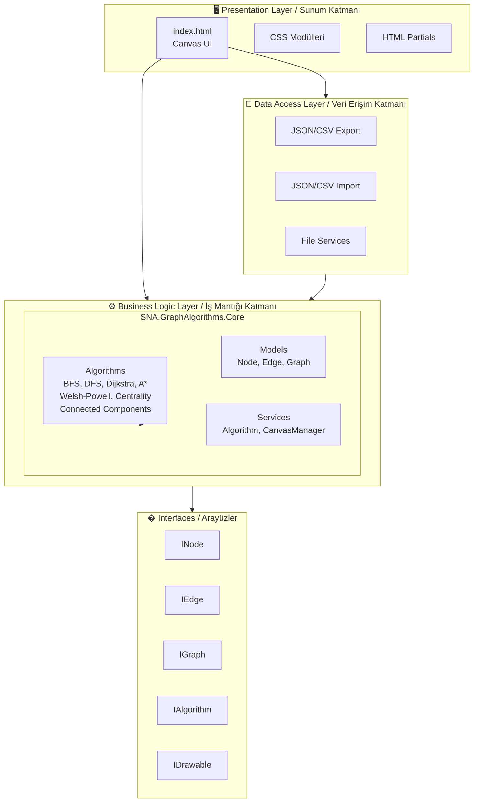

# 🌐 Sosyal Ağ Analizi Uygulaması

<div align="center">


**Graf teorisi tabanlı interaktif sosyal ağ analizi ve görselleştirme aracı**

[Demo](#kullanım) • [Özellikler](#-özellikler) • [Kurulum](#-kurulum) • [Algoritmalar](#-desteklenen-algoritmalar)

</div>

---

## 📖 Hakkında

Bu proje, sosyal ağları interaktif olarak oluşturmanıza, görselleştirmenize ve analiz etmenize olanak sağlayan web tabanlı bir uygulamadır. Canvas API kullanılarak geliştirilen bu araç ile düğümler oluşturabilir, aralarında bağlantılar kurabilir ve çeşitli graf algoritmalarını çalıştırarak ağ yapısını analiz edebilirsiniz.

## ✨ Özellikler

### 🎨 Graf Oluşturma ve Düzenleme
- **Manuel Düğüm Ekleme**: Canvas üzerine tıklayarak düğüm oluşturma
- **Rastgele Ağ Üretimi**: Otomatik olarak rastgele sosyal ağ oluşturma
- **Sürükle-Bırak Bağlantı**: Düğümler arasında kolay bağlantı oluşturma
- **Bağlantı Silme**: İstenmeyen bağlantıları kaldırma
- **Düğüm Silme**: Çift tıklama ile düğüm silme

### 🔍 Algoritmalar
- **BFS (Genişlik Öncelikli Arama)**: Ağı seviye seviye keşfetme
- **DFS (Derinlik Öncelikli Arama)**: Ağı derinlemesine tarama
- **Dijkstra En Kısa Yol**: İki düğüm arasındaki en kısa yolu bulma
- **A* En Kısa Yol**: Sezgisel yaklaşım ile hızlı en kısa yol bulma
- **Welsh-Powell Renklendirme**: Graf renklendirme algoritması
- **Degree Centrality**: Düğümlerin merkezi önemini hesaplama
- **Bağlı Bileşenler**: Graftaki ayrık toplulukları tespit etme

### 📊 Veri Aktarımı
- **JSON Dışa/İçe Aktarım**: Ağ yapısını JSON formatında kaydetme ve yükleme
- **CSV Dışa Aktarım**: Düğüm özelliklerini tablo formatında dışa aktarma
- **CSV İçe Aktarım**: Mevcut verileri içe aktarma

### 🖥️ Kullanıcı Arayüzü
- Modern ve responsive tasarım
- Animasyonlu gradient arka plan
- Modal popup ile detaylı düğüm bilgileri
- Gerçek zamanlı istatistikler (düğüm ve bağlantı sayıları)
- Interaktif kullanım kılavuzu

## 🛠️ Teknolojiler

| Teknoloji | Kullanım Alanı |
|-----------|---------------|
| **HTML5** | Sayfa yapısı ve Canvas API |
| **CSS3** | Modüler stil sistemi, animasyonlar |
| **JavaScript (ES6+)** | Graf mantığı, algoritmalar, kullanıcı etkileşimi |
| **Docker** | Containerized deployment |
| **Nginx** | Web sunucusu |

## 🏗️ Mimari Yapı

Proje, **3 katmanlı mimari** (N-Tier Architecture) prensiplerine uygun olarak tasarlanmıştır:



### Katman Açıklamaları

| Katman | Açıklama | Dosyalar |
|--------|----------|----------|
| **Presentation Layer** | Kullanıcı arayüzü ve görsel bileşenler | `index.html`, `css/`, `html/partials/` |
| **Business Logic Layer** | Graf algoritmaları ve iş mantığı | `js/services/`, `js/models/` |
| **Data Access Layer** | Dosya okuma/yazma işlemleri | JSON/CSV import/export |
| **Interfaces** | Sözleşme tabanlı arayüz tanımları | `js/interfaces/` |

## �📁 Proje Yapısı

```
📦 Sosyal_Ag_Analiz_Uygulamasi
├── 📄 index.html                    # Ana sayfa
├── 📄 script.js                     # Ana JavaScript dosyası
├── 📄 Dockerfile                    # Docker konfigürasyonu
├── 📄 README.md                     # Proje dokümantasyonu
│
├── 📂 js/                           # JavaScript modülleri
│   ├── 📄 app.js                    # Uygulama başlatıcı
│   │
│   ├── 📂 interfaces/               # 📋 Arayüz tanımları (Contracts)
│   │   ├── IAlgorithm.js            # Algoritma arayüzü
│   │   ├── IDrawable.js             # Çizilebilir nesne arayüzü
│   │   ├── IEdge.js                 # Kenar arayüzü
│   │   ├── IGraph.js                # Graf arayüzü
│   │   └── INode.js                 # Düğüm arayüzü
│   │
│   ├── 📂 models/                   # 📊 Veri modelleri
│   │   ├── Node.js                  # Düğüm sınıfı
│   │   ├── Edge.js                  # Kenar sınıfı
│   │   └── Graph.js                 # Graf sınıfı
│   │
│   ├── 📂 services/                 # ⚙️ İş mantığı servisleri
│   │   ├── Algorithm.js             # Algoritma facade sınıfı
│   │   └── 📂 algorithms/           # Algoritma implementasyonları
│   │       ├── BaseAlgorithm.js     # Temel algoritma (Abstract)
│   │       ├── BFSAlgorithm.js      # Genişlik öncelikli arama
│   │       ├── DFSAlgorithm.js      # Derinlik öncelikli arama
│   │       ├── DijkstraAlgorithm.js # Dijkstra en kısa yol
│   │       ├── AStarAlgorithm.js    # A* en kısa yol
│   │       ├── WelshPowellAlgorithm.js      # Graf renklendirme
│   │       ├── DegreeCentralityAlgorithm.js # Derece merkeziliği
│   │       ├── ConnectedComponentsAlgorithm.js # Bağlı bileşenler
│   │       └── AlgorithmFactory.js  # Fabrika deseni
│   │
│   └── 📂 ui/                       # 🖥️ Kullanıcı arayüzü
│       └── CanvasManager.js         # Canvas yöneticisi
│
├── 📂 css/                          # 🎨 Modüler CSS yapısı
│   ├── main.css                     # Ana CSS (imports)
│   ├── 📂 base/                     # Temel stiller
│   │   ├── variables.css            # CSS değişkenleri
│   │   ├── reset.css                # CSS reset
│   │   ├── animations.css           # Animasyonlar
│   │   └── background.css           # Arka plan stilleri
│   ├── 📂 components/               # Bileşen stilleri
│   │   ├── buttons.css              # Buton stilleri
│   │   ├── cards.css                # Kart stilleri
│   │   └── modal.css                # Modal stilleri
│   ├── 📂 layout/                   # Yerleşim stilleri
│   │   ├── container.css            # Container stilleri
│   │   └── panels.css               # Panel stilleri
│   └── 📂 sections/                 # Bölüm stilleri
│       ├── help.css                 # Yardım bölümü
│       ├── results.css              # Sonuç bölümü
│       └── stats.css                # İstatistik bölümü
│
└── 📂 html/                         # 📄 HTML parçaları
    └── 📂 partials/                 # Modüler HTML bileşenleri
        ├── algorithm-controls.html  # Algoritma kontrolleri
        ├── node-controls.html       # Düğüm kontrolleri
        ├── data-controls.html       # Veri aktarım kontrolleri
        ├── canvas.html              # Canvas bölümü
        ├── results.html             # Sonuç gösterimi
        ├── stats.html               # İstatistikler
        ├── help.html                # Kullanım kılavuzu
        └── modal.html               # Modal pencere
```

## 🚀 Kurulum

### Yerel Çalıştırma

1. Projeyi klonlayın:
```bash
git clone https://github.com/[kullaniciadi]/sosyal-ag-analizi.git
cd sosyal-ag-analizi
```

2. `index.html` dosyasını bir web tarayıcısında açın veya bir yerel sunucu başlatın:
```bash
# Python ile
python -m http.server 8000

# Node.js ile
npx serve
```

3. Tarayıcıda `http://localhost:8000` adresine gidin.

### Docker ile Çalıştırma

1. Docker imajını oluşturun:
```bash
docker build -t sosyal-ag-analizi .
```

2. Konteyneri başlatın:
```bash
docker run -d -p 8080:80 sosyal-ag-analizi
```

3. Tarayıcıda `http://localhost:8080` adresine gidin.

## 📖 Kullanım

### Temel İşlemler

| İşlem | Nasıl Yapılır |
|-------|--------------|
| 🖱️ **Düğüm Ekle** | Canvas'a tıklayın veya "Düğüm Ekle" butonunu kullanın |
| 🔗 **Bağlantı Oluştur** | Bir düğümden başka bir düğüme sürükleyin |
| 🗑️ **Düğüm Sil** | Düğüme çift tıklayın |
| ✂️ **Bağlantı Sil** | "Bağlantı Sil" modunu aktifleştirip iki düğüme sırayla tıklayın |
| ℹ️ **Bilgi Görüntüle** | "Düğüm Bilgisi" modunda düğüme tıklayın |
| 🎲 **Rastgele Ağ** | "Rastgele Ağ Üret" butonuna tıklayın |

### Algoritma Çalıştırma

1. Sol panelden bir algoritma seçin
2. "Algoritmayı Çalıştır" butonuna tıklayın
3. Gerekirse başlangıç/bitiş düğümlerini seçin
4. Sonuçları görsel olarak canvas üzerinde ve sonuç panelinde inceleyin

## 🔬 Desteklenen Algoritmalar

### BFS (Breadth-First Search)
Başlangıç düğümünden itibaren ağı seviye seviye keşfeder. Kısa yol bulma ve bağlantı analizi için uygundur.

### DFS (Depth-First Search)
Ağı derinlemesine tarar, bir yol tükenene kadar ilerler sonra geri döner. Döngü tespiti ve bileşen analizi için kullanılır.

### Dijkstra En Kısa Yol
Ağırlıklı grafta iki düğüm arasındaki en kısa yolu bulur. Sosyal ağlarda "aradaki derece" hesaplaması için idealdir.

### A* (A-Star) En Kısa Yol
Dijkstra algoritmasının sezgisel (heuristic) fonksiyon ile geliştirilmiş versiyonudur. Öklid mesafesi kullanarak hedefe yönelik arama yapar ve daha az düğüm inceleyerek hızlı sonuç verir.

### Welsh-Powell Renklendirme
Düğümleri minimum renk sayısı ile boyar, komşu düğümler farklı renklere sahip olur. Çakışma tespiti ve zamanlama problemleri için kullanılır.

### Degree Centrality
Her düğümün bağlantı sayısını hesaplayarak ağdaki önemini belirler. Sosyal ağlarda etki analizi için kullanılır.

## 📸 Ekran Görüntüleri

<div align="center">

*Uygulama ekran görüntüleri buraya eklenebilir*

</div>

## 🤝 Katkıda Bulunma

1. Bu repository'yi fork edin
2. Yeni bir branch oluşturun (`git checkout -b feature/yeni-ozellik`)
3. Değişikliklerinizi commit edin (`git commit -m 'Yeni özellik eklendi'`)
4. Branch'inizi push edin (`git push origin feature/yeni-ozellik`)
5. Pull Request açın

## 📄 Lisans

Bu proje MIT lisansı altında lisanslanmıştır. Detaylar için [LICENSE](LICENSE) dosyasına bakın.

## 👨‍💻 Geliştirici

Bu proje üniversite projesi olarak geliştirilmiştir.

---

<div align="center">

⭐ Bu projeyi beğendiyseniz yıldız vermeyi unutmayın!

</div>
